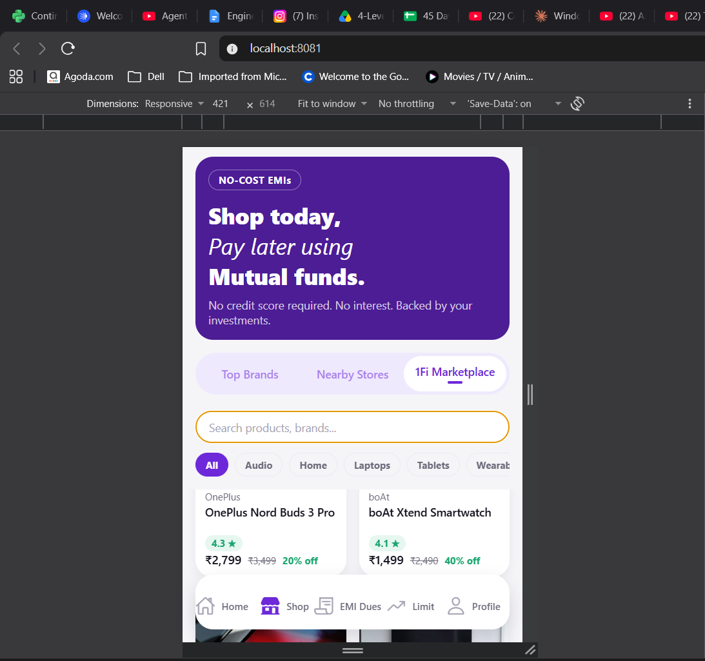
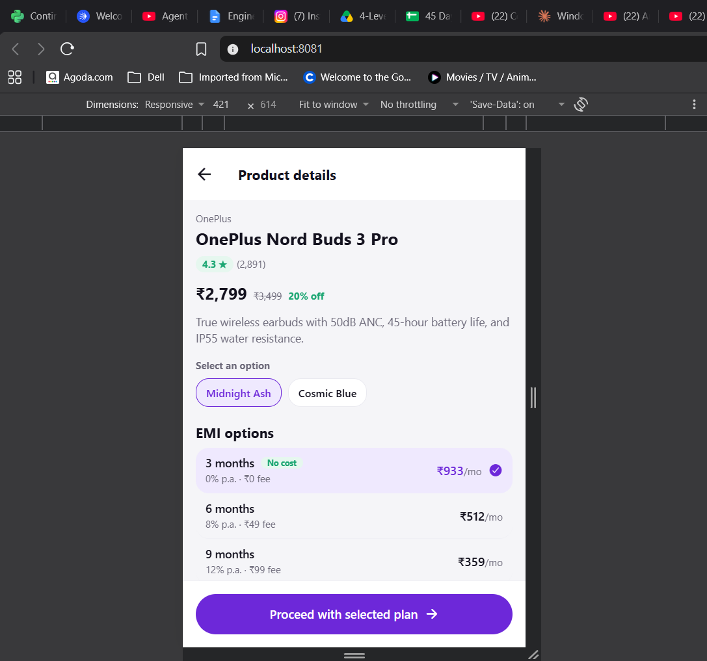
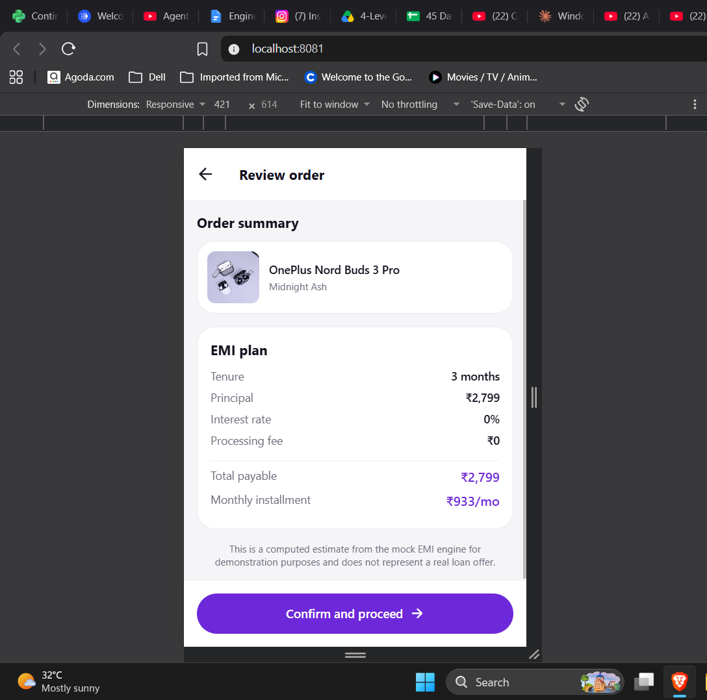
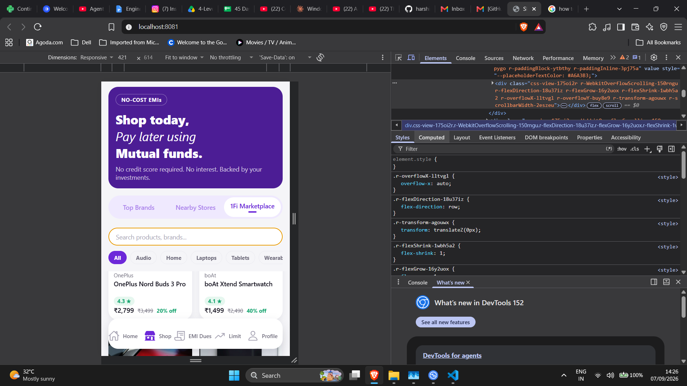

# 1Fi Marketplace

A full-stack mobile marketplace experience built for the 1Fi SDE Intern technical assignment. Users can browse products, pick a variant, choose a no-cost EMI plan, and review a **server-computed** EMI quote before confirming — all backed by a small FastAPI service so no pricing or EMI logic is ever hardcoded on the client.

The project's goal wasn't just "make a shopping screen" — it was to fit a brand-new Marketplace feature into 1Fi's existing Shop page design language, with the same rigor (loading/error/empty states, tested EMI math, typed API contracts) a real production PR would need.

## Features

- 🛍️ **Product listing** — searchable, filterable by category, with a responsive grid
- 🎨 **Variant selection** — color/style options per product, with out-of-stock variants clearly disabled
- 💳 **No-cost & interest-bearing EMI plans** — tenure, interest rate, processing fee, and monthly installment shown per plan
- 🧾 **Order review with a real computed quote** — the final payable amount and monthly installment come from the backend, not the client, exactly like a real fintech checkout should work
- 🧭 **1Fi-style navigation** — floating 5-tab bottom nav (Home / Shop / EMI Dues / Limit / Profile) plus a segmented Top Brands / Nearby Stores / 1Fi Marketplace selector on the Shop page
- ⏳ **Loading, error (with retry), and empty states** on every data-fetching screen — not just the happy path
- 🔍 **Debounced search** and pull-to-refresh on the product listing
- ♿ **Accessibility built in** — `accessibilityRole`/`accessibilityState` on every interactive element, 44dp minimum touch targets
- 🧪 **Tested** — pytest on the backend's EMI math, strict-mode TypeScript passing clean on the frontend

## Technologies Used

**Frontend (`mobile/`)**
- [Expo](https://expo.dev/) (React Native) + TypeScript
- React Navigation (native-stack + bottom-tabs)
- `@expo/vector-icons`

**Backend (`backend/`)**
- Python 3 + [FastAPI](https://fastapi.tiangolo.com/)
- Uvicorn (ASGI server)
- Pytest for testing

**Data**
- A local JSON file acting as a mock product/EMI database, accessed through a single repository layer

## Installation and Setup

### Prerequisites
- Node.js (LTS) and npm
- Python 3.10+
- Git

### 1. Clone the repository

```bash
git clone https://github.com/harshitgautam020703/1fi-marketplace-assignment.git
cd 1fi-marketplace-assignment
```

### 2. Set up the backend

```bash
cd backend
python3 -m venv venv
source venv/bin/activate        # Windows: venv\Scripts\activate
pip install -r requirements.txt
uvicorn app.main:app --reload
```

The API is now live at `http://localhost:8000` (interactive docs at `http://localhost:8000/docs`).

### 3. Set up the mobile app

In a **second terminal**:

```bash
cd mobile
npm install
npx expo start --web --clear
```

This opens the app at `http://localhost:8081`.

> **Physical device via Expo Go?** Your phone can't resolve your computer's `localhost`. Find your machine's LAN IP and update `API_BASE_URL` in `mobile/src/services/api.ts` to `http://<your-lan-ip>:8000/api`. Phone and computer must be on the same Wi-Fi network.

No environment variables are required for local development — the backend URL is the only configurable value, and it's set directly in `src/services/api.ts`.

## Usage Instructions

Once both servers are running:

1. Land on the **Shop** tab — the **1Fi Marketplace** segment is selected by default.
2. Browse or search products, or filter by category chip.
3. Tap a product to open **Product Details** — pick a variant, then pick an EMI tenure.
4. Tap **Proceed with selected plan** to go to **Review Order**, which shows the authoritative, backend-computed EMI quote.
5. Tap **Confirm and proceed** to simulate placing the order.

Useful commands:

| Command | Where | What it does |
|---|---|---|
| `uvicorn app.main:app --reload` | `backend/` | Run the API with hot reload |
| `pytest tests/ -v` | `backend/` | Run backend tests |
| `npx expo start --web --clear` | `mobile/` | Run the app in a browser |
| `npm run typecheck` | `mobile/` | Strict-mode TypeScript check |
| `npm run lint` | `mobile/` | Lint the mobile codebase |

## Project Structure

```
1fi-marketplace-assignment/
├── backend/
│   ├── app/
│   │   ├── main.py               # FastAPI app entrypoint
│   │   ├── models.py             # Pydantic models
│   │   ├── repository.py         # Single point of contact with the data file
│   │   ├── routers/products.py   # /api/products endpoints, incl. EMI quote
│   │   └── data/products.json    # Mock product/EMI "database"
│   ├── tests/test_products.py    # Pytest suite (EMI math, endpoints)
│   └── requirements.txt
│
└── mobile/
    ├── App.tsx                   # Entry point, sets up navigation
    └── src/
        ├── navigation/           # RootNavigator (stack) + MainTabs (bottom nav)
        ├── screens/              # ShopScreen, MarketplaceListScreen,
        │                         # ProductDetailScreen, OrderReviewScreen, etc.
        ├── components/           # ProductCard, EmiPlanCard, SegmentedTabs, etc.
        ├── services/api.ts       # Single point of contact with the backend
        ├── theme/index.ts        # Design tokens — colors, spacing, type scale
        └── types/index.ts        # Shared TypeScript interfaces + nav param lists
```

## Sample Running Project

**1. Marketplace listing — the Shop page's `1Fi Marketplace` segment**
Product grid with search, category filters, and the floating 5-tab bottom nav. This is the entry point into the whole flow.



**2. Product details — variant and EMI plan selection**
Selecting a color variant updates the highlighted option; each EMI tenure shows its rate, fee, and monthly installment so the user can compare before proceeding.



**3. Order review — the server-computed EMI quote**
This is the number that actually gets charged — fetched from the backend's `/emi-quote` endpoint rather than trusted from the client-side estimate shown in step 2.



**4. Responsive web preview**
The Expo web build rendered in a mobile viewport, used throughout development to verify layout at phone-sized dimensions.



## Contributing

This repository was built as a scoped technical assignment, but contributions or suggestions are welcome:

1. Fork the repository
2. Create a feature branch (`git checkout -b feature/your-feature`)
3. Commit your changes with a clear message
4. Push to your fork and open a Pull Request describing the change
5. For bugs or ideas, open an [issue](../../issues) with steps to reproduce or a clear description

## Acknowledgments

- Built as a technical assignment for **1Fi**, recreating the Shop page's Marketplace section to match 1Fi's real product screenshots (colors, navigation pattern, and EMI plan layout).
- Icons via [`@expo/vector-icons`](https://icons.expo.fyi/).
- Not affiliated with or endorsed by 1Fi — this is an independent implementation built for evaluation purposes.
